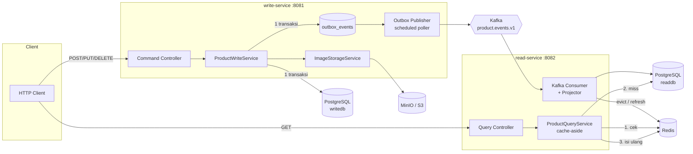

# PLAN — Spring Boot REST API (CQRS: Write/Read Terpisah + Redis Cache + S3 Image)

> Status: **DRAFT — menunggu approval. Belum ada kode yang ditulis.**
> Tanggal: 2026-08-16
> Lokasi project: `/Users/user/Downloads/DesignSystem1`

---

## 1. Ringkasan

Membangun sistem REST API dengan pemisahan penuh antara jalur **tulis (command)** dan **baca (query)**:

| Aspek | Write Service | Read Service |
|---|---|---|
| Port | 8081 | 8082 |
| Database | `writedb` (normalized, source of truth) | `readdb` (denormalized read model) |
| Operasi HTTP | POST / PUT / PATCH / DELETE | GET saja |
| Cache | tidak pakai | Redis (cache-aside) |
| S3 | ya (upload image) | tidak (hanya simpan URL/key) |
| Kafka | producer | consumer |

**Alur baca:** `Client → Read Service → Redis → (miss) → readdb → isi Redis → response`
**Alur tulis:** `Client → Write Service → writedb (+ outbox, 1 transaksi) → Kafka → Read Service → readdb → invalidate Redis`
**Alur tulis image:** `Client → Write Service → MinIO/S3 → writedb (simpan object key) → Kafka → read model`

Domain contoh yang dipakai: **Product** (katalog produk dengan gambar). Cukup sederhana untuk tidak mengaburkan arsitektur, tapi cukup kaya untuk menguji semua jalur (create/update/delete, list + paging, upload image).

---

## 2. Diagram Alur



### 2.1 Sequence — Baca (yang jadi requirement utama)

```
GET /api/v1/products/{id}
  │
  ├─ 1. Redis GET product:v1:{id}
  │      ├─ HIT  → deserialize → return 200  (header X-Cache: HIT)
  │      └─ MISS → lanjut
  │
  ├─ 2. (opsional) acquire single-flight lock  product:lock:{id}  SET NX PX 3000
  │      └─ gagal ambil lock → tunggu singkat → re-check Redis → kalau masih miss, tetap ke DB
  │
  ├─ 3. SELECT dari readdb
  │      ├─ ketemu     → Redis SETEX product:v1:{id} <TTL + jitter> → return 200 (X-Cache: MISS)
  │      └─ tidak ada  → Redis SETEX product:v1:{id} <NULL_TTL 30s> "__NULL__"  → return 404
  │                       (negative caching, cegah cache penetration)
  │
  └─ Redis error / timeout → LOG WARN + fail-open langsung ke DB (jangan 500)
```

---

## 3. Keputusan Arsitektur (ringkas + alasannya)

| # | Keputusan | Alasan | Alternatif yang ditolak |
|---|---|---|---|
| AD-1 | Multi-module Maven, 2 aplikasi deployable + 1 module `common` | Bisa di-scale independen; read biasanya 10–100x traffic write | Monolit 1 app — tidak memenuhi "service dipisah" |
| AD-2 | 2 database terpisah (`writedb`, `readdb`) di 1 instance Postgres | Read model boleh denormalized & punya index sendiri; instance sama supaya ringan di lokal | 1 DB 2 schema — kurang tegas pemisahannya |
| AD-3 | **Transactional Outbox** untuk publish event | Menjamin atomicity "simpan ke DB" + "kirim ke Kafka". Tanpa ini, app crash setelah commit DB = event hilang selamanya = read model beda dengan write DB | Publish langsung di service — tidak atomic (dual-write problem) |
| AD-4 | Kafka key = `productId`, 1 topic partisi-N | Menjamin urutan event **per produk** (bukan global), yang memang yang kita butuhkan | Key null — urutan tidak terjamin, update bisa terbalik |
| AD-5 | Consumer idempotent via tabel `processed_events` + guard `aggregate_version` | Kafka itu at-least-once; event bisa datang 2x atau terlambat (stale). Guard versi mencegah data lama menimpa data baru | Andalkan exactly-once Kafka — kompleks & tidak melindungi dari replay |
| AD-6 | Cache-aside manual pakai `RedisTemplate`, **bukan** `@Cacheable` | Kita butuh kontrol eksplisit: negative caching, TTL jitter, fail-open saat Redis mati, metrik hit/miss. `@Cacheable` menyembunyikan semua ini | `@Cacheable` — cepat tapi tidak bisa fail-open dengan rapi |
| AD-7 | Invalidasi cache **setelah** projection commit (bukan dari write-service) | Kalau write-service yang evict, ada race: cache dievict → read repopulate dari readdb yang belum ter-update → cache isi data basi | Evict dari write-service |
| AD-8 | Simpan **object key** di DB, bukan URL lengkap | Bucket/endpoint/CDN bisa berubah tanpa migrasi data. URL dibentuk saat response | Simpan full URL |
| AD-9 | AWS SDK v2 dengan `endpointOverride` + path-style | Kode sama persis untuk MinIO lokal dan AWS S3 produksi — cukup ganti config | MinIO SDK — vendor lock-in |
| AD-10 | Eventual consistency diterima & diekspos | Write return `201` + header `X-Read-Consistency: eventual`. Jujur ke client daripada pura-pura sinkron | Sync write ke read model — merusak tujuan CQRS |

---

## 4. Stack & Versi

| Komponen | Versi | Catatan |
|---|---|---|
| Java | **21** | Tersedia di mesin: `/Users/user/Library/Java/JavaVirtualMachines/openjdk-21.0.1/Contents/Home` |
| Spring Boot | 3.3.x | Patch exact di-pin saat T-01 (cek rilis stabil terakhir) |
| Maven | `/Users/user/Downloads/apache-maven/bin/mvn` | ✅ ada |
| PostgreSQL | 16-alpine | container |
| Redis | 7-alpine | container |
| Kafka | `apache/kafka:3.8.x` mode KRaft | tanpa Zookeeper, 1 container |
| MinIO | `minio/minio:latest` | S3-compatible |
| AWS SDK | v2 (`software.amazon.awssdk:s3`) | |
| Migrasi DB | Flyway | per-service, folder terpisah |
| Docs | springdoc-openapi 2.x | Swagger UI di tiap service |
| Test | JUnit 5, Mockito, Testcontainers, Awaitility | Awaitility untuk assert eventual consistency |
| Lain | Lombok, MapStruct, Micrometer | |

**⚠️ Blocker environment yang sudah ditemukan:** `JAVA_HOME` saat ini di-set ke `/Library/Java/JavaVirtualMachines/jdk-11.0.15.jdk` — **kurang `/Contents/Home`**, sehingga `mvn` gagal jalan sama sekali. Harus dibetulkan lebih dulu (task T-00).

---

## 5. Struktur Project

```
DesignSystem1/
├── pom.xml                         # parent, dependencyManagement, <modules>
├── docker-compose.yml              # postgres, redis, kafka, minio, kafka-ui
├── docker-compose.app.yml          # overlay: 2 service ikut di-container-kan
├── Makefile                        # make up / down / build / test / smoke
├── .env.example
├── README.md
├── PLAN.md                         # ← file ini
├── TASKS.md                        # checklist eksekusi
│
├── common/
│   └── src/main/java/com/example/common/
│       ├── event/                  # EventEnvelope, ProductEvent*, EventType, Topics
│       ├── dto/                    # ProductPayload (dipakai bareng producer & consumer)
│       └── error/                  # ApiError, ErrorCode
│
├── write-service/
│   ├── Dockerfile
│   └── src/main/
│       ├── java/com/example/write/
│       │   ├── api/                # ProductCommandController, ImageController, ExceptionHandler
│       │   ├── domain/             # Product (JPA), OutboxEvent, IdempotencyKey
│       │   ├── repository/
│       │   ├── service/            # ProductWriteService, ImageStorageService, IdempotencyService
│       │   ├── outbox/             # OutboxPublisher (scheduled), OutboxRecorder
│       │   └── config/             # S3Config, KafkaProducerConfig, JpaConfig
│       └── resources/
│           ├── application.yml, application-local.yml, application-docker.yml
│           └── db/migration/       # V1__products.sql, V2__outbox.sql, V3__idempotency.sql
│
└── read-service/
    ├── Dockerfile
    └── src/main/
        ├── java/com/example/read/
        │   ├── api/                # ProductQueryController, CacheAdminController
        │   ├── domain/             # ProductReadModel (JPA), ProcessedEvent
        │   ├── repository/
        │   ├── service/            # ProductQueryService (cache-aside), CachePort
        │   ├── cache/              # RedisCacheAdapter, CacheKeys, CacheMetrics
        │   ├── consumer/           # ProductEventListener, ProductProjector, DltHandler
        │   └── config/             # RedisConfig, KafkaConsumerConfig
        └── resources/
            ├── application*.yml
            └── db/migration/       # V1__product_read_model.sql, V2__processed_events.sql
```

---

## 6. Model Data

### 6.1 `writedb.products` — source of truth
| Kolom | Tipe | Keterangan |
|---|---|---|
| `id` | UUID PK | |
| `sku` | VARCHAR(64) UNIQUE NOT NULL | |
| `name` | VARCHAR(255) NOT NULL | |
| `description` | TEXT | |
| `price` | NUMERIC(19,2) NOT NULL | |
| `currency` | CHAR(3) NOT NULL DEFAULT 'IDR' | |
| `stock` | INT NOT NULL DEFAULT 0 | |
| `image_object_key` | VARCHAR(512) NULL | key di S3, bukan URL |
| `image_content_type` | VARCHAR(100) NULL | |
| `image_size_bytes` | BIGINT NULL | |
| `status` | VARCHAR(20) NOT NULL | ACTIVE / INACTIVE / DELETED |
| `version` | BIGINT NOT NULL | `@Version` — optimistic lock **dan** dipakai sebagai `aggregate_version` di event |
| `created_at`, `updated_at` | TIMESTAMPTZ | |

### 6.2 `writedb.outbox_events`
| Kolom | Tipe | Keterangan |
|---|---|---|
| `id` | BIGSERIAL PK | urutan insert = urutan publish |
| `event_id` | UUID UNIQUE | dipakai consumer untuk dedup |
| `aggregate_type` | VARCHAR(50) | `PRODUCT` |
| `aggregate_id` | UUID | jadi Kafka message key |
| `aggregate_version` | BIGINT | |
| `event_type` | VARCHAR(50) | |
| `payload` | JSONB | |
| `headers` | JSONB | traceId, dll |
| `status` | VARCHAR(20) | `PENDING` / `PUBLISHED` / `FAILED` |
| `attempts` | INT DEFAULT 0 | |
| `next_attempt_at` | TIMESTAMPTZ | exponential backoff |
| `created_at`, `published_at` | TIMESTAMPTZ | |

Index: `(status, next_attempt_at, id)` untuk query poller.

### 6.3 `writedb.idempotency_keys`
`key` PK, `endpoint`, `request_hash`, `response_status`, `response_body` JSONB, `created_at`, `expires_at`.
Melindungi POST dari retry ganda client (misal timeout lalu retry → jangan bikin 2 produk).

### 6.4 `readdb.product_read_model` — denormalized
Semua kolom dari `products` **plus**: `image_url` (di-materialize saat baca / disimpan sebagai key + dibangun saat response), `searchable_text` (tsvector opsional untuk search), `last_event_id`, `aggregate_version`, `projected_at`.
Index: `(status, created_at DESC)`, `(sku)`, GIN untuk search.

### 6.5 `readdb.processed_events`
`event_id` UUID PK, `aggregate_id`, `aggregate_version`, `event_type`, `processed_at`.
Insert bareng projection dalam **satu transaksi**. Kalau `event_id` sudah ada → skip (duplicate). Kalau `aggregate_version` <= versi di read model → skip (stale/out-of-order).

---

## 7. Kontrak API

### Write Service — `http://localhost:8081`
| Method | Path | Body | Response |
|---|---|---|---|
| POST | `/api/v1/products` | JSON `CreateProductRequest` (header opsional `Idempotency-Key`) | `201` + `Location` + body produk |
| PUT | `/api/v1/products/{id}` | `UpdateProductRequest` (header `If-Match: <version>` opsional) | `200` |
| PATCH | `/api/v1/products/{id}/stock` | `{ "delta": -3 }` | `200` |
| DELETE | `/api/v1/products/{id}` | — | `204` (soft delete → status DELETED) |
| **POST** | **`/api/v1/products/{id}/image`** | `multipart/form-data` field `file` | `200` + `{ imageUrl, objectKey, sizeBytes }` |
| DELETE | `/api/v1/products/{id}/image` | — | `204` |
| GET | `/actuator/health`, `/swagger-ui.html` | | |

> Write service **sengaja tidak punya GET** produk. Semua baca lewat read-service. (Pengecualian: response body dari POST/PUT adalah echo dari hasil tulis, bukan query.)

### Read Service — `http://localhost:8082`
| Method | Path | Query | Response |
|---|---|---|---|
| GET | `/api/v1/products/{id}` | — | `200` + header `X-Cache: HIT\|MISS\|BYPASS` |
| GET | `/api/v1/products` | `page,size,sort,status,q,minPrice,maxPrice` | `200` page |
| GET | `/api/v1/products/by-sku/{sku}` | — | `200` |
| POST | `/api/v1/admin/cache/evict/{id}` | (di-guard) | `204` — untuk ops/debug |
| GET | `/actuator/metrics/cache.product.*` | | hit ratio |

### Format error seragam (RFC 7807-ish)
```json
{ "timestamp":"...", "status":404, "code":"PRODUCT_NOT_FOUND",
  "message":"Product ... not found", "path":"/api/v1/products/...", "traceId":"..." }
```

---

## 8. Kontrak Event Kafka

**Topic:** `product.events.v1` — 3 partisi, replication 1 (lokal), `cleanup.policy=delete`, retention 7 hari.
**DLT:** `product.events.v1.DLT`
**Key:** `aggregateId` (string UUID) → urutan terjamin per produk.

```json
{
  "eventId": "uuid",
  "eventType": "PRODUCT_CREATED | PRODUCT_UPDATED | PRODUCT_DELETED | PRODUCT_IMAGE_UPDATED | PRODUCT_IMAGE_REMOVED",
  "aggregateType": "PRODUCT",
  "aggregateId": "uuid",
  "aggregateVersion": 3,
  "occurredAt": "2026-08-16T10:00:00Z",
  "payload": { "...snapshot lengkap produk setelah perubahan..." }
}
```

**Keputusan: payload berisi snapshot penuh, bukan delta.** Alasannya projector jadi idempotent secara alami (upsert saja) dan tidak perlu urutan sempurna untuk delta. Header Kafka membawa `traceId` dan `eventType` supaya bisa routing tanpa deserialize.

Producer config: `acks=all`, `enable.idempotence=true`, `max.in.flight=5`, `retries=MAX`, `compression=snappy`.
Consumer config: `enable.auto.commit=false`, manual `AckMode.RECORD`, `isolation.level=read_committed`, `DefaultErrorHandler` + `ExponentialBackOff(1s, 2.0, max 5x)` → `DeadLetterPublishingRecoverer`.

---

## 9. Strategi Cache Redis (detail)

| Item | Nilai |
|---|---|
| Key produk | `product:v1:{id}` |
| Key by-sku | `product:sku:v1:{sku}` → simpan `id` saja (pointer), lalu ambil key utama |
| Key list | `product:list:v1:{hash(queryParams)}` — TTL pendek (60s) |
| TTL default | 600 detik **+ jitter random 0–60s** (cegah semua key expired bersamaan) |
| TTL negative cache | 30 detik, value sentinel `"__NULL__"` |
| Serializer | `GenericJackson2JsonRedisSerializer` (JSON, bisa diinspeksi via redis-cli) |
| Invalidasi | `DEL product:v1:{id}` + `DEL` pointer sku, dijalankan **setelah** transaksi projection commit (`TransactionSynchronization.afterCommit`) |
| List cache | tidak di-invalidate per-id (mahal). Andalkan TTL 60s. Didokumentasikan sebagai trade-off |
| Redis down | **fail-open**: timeout 200ms, tangkap exception, log WARN, langsung ke DB, response `X-Cache: BYPASS`. API tetap 200 |
| Stampede | single-flight lock `product:lock:v1:{id}` `SET NX PX 3000`; yang gagal ambil lock tunggu 50ms × 3 lalu re-check cache, kalau tetap miss → jalan ke DB (tidak block selamanya) |
| Metrik | counter `cache.product.hit`, `.miss`, `.bypass`, `.negative_hit` → expose di `/actuator/metrics` |

**Kenapa invalidate, bukan write-through dari consumer?** Invalidate lebih aman: kalau ada 2 event balapan, cache kosong akan diisi dari state DB terkini. Write-through bisa menulis state lama kalau urutannya terbalik.

---

## 10. Strategi S3 / MinIO (detail)

- **Bucket:** `product-images` (auto-create saat startup kalau belum ada, hanya di profile non-prod).
- **Object key:** `products/{productId}/{uuid}.{ext}` — pakai UUID baru tiap upload supaya bisa cache-bust dan tidak overwrite.
- **Validasi upload (berlapis):**
  1. Ukuran ≤ 5 MB (batas juga di `spring.servlet.multipart.max-file-size`).
  2. Content-type whitelist: `image/jpeg`, `image/png`, `image/webp`.
  3. **Cek magic bytes** file — jangan percaya header dari client (PNG `89 50 4E 47`, JPEG `FF D8 FF`, WEBP `RIFF....WEBP`).
  4. Sanitasi nama file asli (tidak dipakai jadi key, hanya disimpan sebagai metadata).
- **Urutan operasi & kompensasi** (ini bagian yang rawan):
  ```
  1. upload object baru ke S3          → dapat newKey
  2. UPDATE products SET image_object_key = newKey  (transaksi + outbox event)
     ├─ gagal → DELETE object newKey dari S3 (kompensasi) → lempar 500
     └─ sukses → commit
  3. setelah commit: DELETE object lama (oldKey) — best-effort, kegagalan hanya di-log
  ```
  Prinsipnya: **upload dulu, commit DB, hapus yang lama terakhir.** Orphan object di S3 jauh lebih tidak berbahaya daripada row DB yang menunjuk ke object yang tidak ada.
- **Orphan cleanup:** job terjadwal (mingguan) yang membandingkan object di bucket vs `image_object_key` di DB. Masuk backlog, bukan MVP.
- **Baca image:** read-service membentuk URL dari key. Dua mode via config:
  - `PUBLIC` → `{cdnBaseUrl}/{bucket}/{key}` (untuk bucket publik/CDN)
  - `PRESIGNED` → presigned GET URL, TTL 15 menit (default lokal). **Presigned URL tidak boleh masuk cache Redis** dengan TTL lebih panjang dari masa berlaku URL-nya — yang di-cache adalah object key; URL dibentuk saat serialisasi response.

---

## 11. Breakdown Task

Legenda: `[P]` = bisa dikerjakan paralel dengan task lain di fase sama. Estimasi = ukuran relatif, bukan jam.

### Fase 0 — Fondasi & Infra Lokal
| ID | Task | Deliverable | Selesai kalau |
|---|---|---|---|
| T-00 | Betulkan `JAVA_HOME` (saat ini rusak — kurang `/Contents/Home`) | catatan di README + `.envrc`/export | `mvn -v` menampilkan Java 21 |
| T-01 | Parent `pom.xml` multi-module, pin versi Spring Boot, `.gitignore`, `git init` | pom parent + 3 module kosong | `mvn -q clean install` sukses |
| T-02 | `docker-compose.yml`: postgres(2 db via init script), redis, kafka KRaft, minio, minio-init, kafka-ui | compose + `init-db.sql` | `docker compose up -d` semua healthy |
| T-03 | `Makefile` + `.env.example` | `make up/down/build/test/logs` | tiap target jalan |
| T-04 | Verifikasi infra manual | catatan di README | psql konek ke 2 DB, `redis-cli PING`, MinIO console buka, topic Kafka bisa dibuat |

### Fase 1 — Module `common`
| ID | Task | Selesai kalau |
|---|---|---|
| T-05 | `EventEnvelope<T>`, enum `EventType`, konstanta `Topics`, `ProductPayload` | serialize/deserialize round-trip lolos unit test |
| T-06 | `ApiError`, `ErrorCode`, konfigurasi Jackson bersama (JavaTimeModule, ISO-8601, snake/camel konsisten) | unit test format JSON |

### Fase 2 — Write Service (command side)
| ID | Task | Selesai kalau |
|---|---|---|
| T-07 | Bootstrap app: main class, `application.yml` 3 profile, actuator, springdoc | `/actuator/health` = UP, Swagger terbuka |
| T-08 | Flyway `writedb`: `V1__products`, `V2__outbox_events`, `V3__idempotency_keys` | migrasi jalan dari nol, tabel & index sesuai §6 |
| T-09 | Entity `Product` + `@Version`, repository, `OutboxEvent` entity | slice test JPA lolos |
| T-10 | `ProductWriteService`: create / update / patchStock / softDelete — **DB + outbox dalam satu `@Transactional`** | integration test: rollback DB juga me-rollback outbox |
| T-11 | Command controller + Bean Validation + `@RestControllerAdvice` | 400 dengan field error rapi; 409 saat SKU duplikat; 404; 412 saat version mismatch |
| T-12 | `[P]` Idempotency-Key: interceptor/filter + tabel + TTL | POST 2x dengan key sama → 1 row, response identik |
| T-13 | `OutboxPublisher`: `@Scheduled` poll (`FOR UPDATE SKIP LOCKED`, batch 100) → Kafka → tandai PUBLISHED; gagal → `attempts++` + backoff | test: matikan Kafka → status tetap PENDING; hidupkan → terkirim |
| T-14 | `[P]` `KafkaProducerConfig` (acks=all, idempotent, key serializer) + auto-create topic | pesan muncul di kafka-ui dengan key benar |

### Fase 3 — Image / S3 (write side)
| ID | Task | Selesai kalau |
|---|---|---|
| T-15 | `S3Config`: `S3Client` v2 + `endpointOverride` + `pathStyleAccessEnabled` + `S3Presigner`, auto-create bucket (non-prod) | startup konek MinIO, bucket ada |
| T-16 | `ImageStorageService`: `upload/delete/presign`, validasi ukuran + content-type + **magic bytes**, penamaan key | unit test: file `.png` yang isinya PDF → ditolak 415 |
| T-17 | `POST/DELETE /products/{id}/image` dengan urutan + kompensasi sesuai §10 | integration test: paksa DB gagal → object di S3 ikut terhapus (tidak ada orphan) |
| T-18 | `[P]` Konfigurasi mode URL (`PUBLIC` / `PRESIGNED`) + event `PRODUCT_IMAGE_UPDATED` | event terbit membawa objectKey baru |

### Fase 4 — Read Service (query side)
| ID | Task | Selesai kalau |
|---|---|---|
| T-19 | Bootstrap read-service (port 8082, profile, actuator, springdoc) | health UP |
| T-20 | Flyway `readdb`: `V1__product_read_model`, `V2__processed_events` + index | migrasi jalan dari nol |
| T-21 | `ProductEventListener` + `ProductProjector`: upsert read model, **dedup by `event_id`**, **skip kalau `aggregateVersion` ≤ versi tersimpan**, insert `processed_events` dalam transaksi sama | test: kirim event yang sama 2x → 1 row, tidak berubah; kirim event versi lama → diabaikan |
| T-22 | `[P]` Error handling consumer: `DefaultErrorHandler` + exponential backoff + DLT + listener DLT yang mencatat | pesan poison masuk DLT, consumer tidak macet |
| T-23 | `RedisConfig`: Lettuce, timeout 200ms, pool, serializer JSON, key prefix | `redis-cli KEYS product:*` menampilkan JSON terbaca |
| T-24 | **`ProductQueryService` cache-aside** persis alur §2.1: HIT / MISS / isi ulang / negative cache / TTL+jitter | test: call-1 = MISS + key terisi; call-2 = HIT; DB dimatikan tapi call-3 tetap 200 dari cache |
| T-25 | **Fail-open saat Redis mati** | test: stop container Redis → GET tetap 200, header `X-Cache: BYPASS`, tidak ada 500 |
| T-26 | Invalidasi cache dari projector via `afterCommit` (+ hapus pointer SKU) | test: update via write-service → tunggu (Awaitility) → GET mengembalikan data baru |
| T-27 | `[P]` Query controller: get-by-id, get-by-sku (pointer key), list + paging + filter + cache list TTL pendek | paging & filter benar; header `X-Cache` konsisten |
| T-28 | `[P]` Single-flight lock anti-stampede | test: 50 thread GET bersamaan saat cache kosong → query DB ≤ 2x |
| T-29 | `[P]` Metrik cache (hit/miss/bypass) + endpoint admin evict | `/actuator/metrics/cache.product.hit` naik sesuai skenario |

### Fase 5 — Cross-cutting
| ID | Task | Selesai kalau |
|---|---|---|
| T-30 | Correlation/trace id: filter HTTP → MDC → header Kafka → MDC consumer → response header | satu `traceId` bisa ditelusuri lintas 2 service di log |
| T-31 | `[P]` Health indicator kustom (redis, kafka, s3) + logging JSON terstruktur | `/actuator/health` menampilkan tiap komponen |
| T-32 | `[P]` Eksternalisasi config & secret (env var, `.env`), profile `local`/`docker` | tidak ada kredensial hardcoded |
| T-33 | `[P]` Rate limit sederhana + CORS + graceful shutdown | shutdown menunggu in-flight request selesai |

### Fase 6 — Testing
| ID | Task | Selesai kalau |
|---|---|---|
| T-34 | Unit test service layer (Mockito) kedua service | coverage layer service wajar |
| T-35 | Integration test write-service — Testcontainers (Postgres + Kafka + MinIO) | CRUD + upload image + outbox terbit |
| T-36 | Integration test read-service — Testcontainers (Postgres + Redis + Kafka) | skenario cache HIT/MISS/negative/bypass |
| T-37 | **E2E test**: POST produk → event → projection → `GET` (MISS) → `GET` (HIT) → upload image → `GET` menampilkan URL baru | satu test kelas, pakai Awaitility untuk eventual consistency |
| T-38 | `[P]` Test resiliensi: Redis mati, Kafka mati, S3 mati — masing-masing degradasi yang benar | tidak ada yang berujung 500 kecuali memang harus |

### Fase 7 — Delivery
| ID | Task | Selesai kalau |
|---|---|---|
| T-39 | `Dockerfile` multi-stage + layered jar per service | image ter-build, container jalan |
| T-40 | `docker-compose.app.yml` — full stack sekali `up` | dari nol sampai jalan tanpa langkah manual |
| T-41 | `README.md`: arsitektur, cara run, contoh curl, troubleshooting, penjelasan trade-off | orang lain bisa jalankan tanpa bertanya |
| T-42 | `[P]` File `.http` / koleksi request + `scripts/smoke-test.sh` | skrip smoke lolos end-to-end |

**Total: 43 task.** Jalur kritis: T-00 → T-01 → T-02 → T-05 → T-08 → T-10 → T-13 → T-21 → T-24 → T-26 → T-37.

---

## 12. Konfigurasi (rencana env var)

```
POSTGRES_HOST=localhost   POSTGRES_PORT=5432
WRITE_DB_NAME=writedb     READ_DB_NAME=readdb
DB_USER=appuser           DB_PASSWORD=apppass
REDIS_HOST=localhost      REDIS_PORT=6379
CACHE_TTL_SECONDS=600     CACHE_NULL_TTL_SECONDS=30    CACHE_TTL_JITTER_SECONDS=60
KAFKA_BOOTSTRAP=localhost:9092
S3_ENDPOINT=http://localhost:9000   S3_BUCKET=product-images
S3_ACCESS_KEY=minioadmin  S3_SECRET_KEY=minioadmin     S3_REGION=us-east-1
S3_URL_MODE=PRESIGNED     S3_PRESIGN_TTL_MINUTES=15
MAX_IMAGE_SIZE_MB=5
```

---

## 13. Risiko & Mitigasi

| Risiko | Dampak | Mitigasi |
|---|---|---|
| Dual-write DB + Kafka tidak atomic | Read model permanen beda dengan write DB | Outbox pattern (T-10, T-13) — **ini alasan utama outbox ada** |
| Event duplikat / terbalik urutan | Data lama menimpa data baru | `processed_events` + guard `aggregateVersion` (T-21) |
| Redis mati | Kalau naif: seluruh endpoint baca 500 | Fail-open + timeout 200ms (T-25), diuji eksplisit (T-38) |
| Cache stampede saat key populer expired | Lonjakan query DB | TTL jitter + single-flight lock (T-24, T-28) |
| Cache penetration (query id yang tidak ada berulang) | DB dihajar terus | Negative caching 30s (T-24) |
| Upload S3 sukses tapi DB gagal | Orphan object | Kompensasi delete (T-17) |
| DB sukses tapi delete S3 lama gagal | Orphan object (tidak berbahaya) | Log + job cleanup (backlog) |
| Client bingung data belum muncul setelah POST | Dikira bug | Header `X-Read-Consistency: eventual` + didokumentasikan di README |
| Docker 20.10.14 (agak lama) — sintaks `docker compose` v2 | `make up` gagal | `docker-compose` (dengan tanda hubung) tersedia; Makefile mendeteksi keduanya |
| Semua container di 1 mesin (Kafka+2 Postgres DB+Redis+MinIO) | Berat di laptop | Batasi heap, 1 partisi saat lokal, sediakan profile `lite` |

---

## 14. Definition of Done

- [ ] `docker compose up -d && make run` → seluruh sistem hidup dari nol
- [ ] `POST /api/v1/products` di :8081 → dalam < 2 detik terlihat di `GET` :8082
- [ ] `GET` pertama = `X-Cache: MISS`, `GET` kedua = `X-Cache: HIT`, terverifikasi lewat `redis-cli`
- [ ] `redis-cli FLUSHALL` → `GET` berikutnya MISS lalu HIT lagi (bukan error)
- [ ] Redis container di-stop → `GET` tetap `200` dengan `X-Cache: BYPASS`
- [ ] Upload image → object ada di MinIO → `GET` di read-service menampilkan URL yang bisa dibuka
- [ ] Update produk → cache ter-invalidate → `GET` menampilkan data terbaru
- [ ] Kafka di-stop saat POST → data tetap masuk `writedb`, outbox `PENDING`; Kafka hidup lagi → tersinkron otomatis
- [ ] Kirim event duplikat → read model tidak berubah ganda
- [ ] `mvn clean verify` hijau (unit + Testcontainers)
- [ ] README cukup lengkap untuk dijalankan orang lain tanpa bertanya

---

## 15. Di Luar Scope (backlog)

Sengaja **tidak** dikerjakan agar fokus: autentikasi/JWT & RBAC, image resizing/thumbnail, CDN, full-text search (Elasticsearch), multi-tenancy, K8s manifest & CI/CD, distributed tracing (OpenTelemetry/Jaeger), job cleanup orphan S3, snapshot/replay untuk rebuild read model dari nol, saga lintas agregat.

Kalau ada yang ternyata Anda butuhkan, sebutkan sebelum eksekusi — beberapa (auth, rebuild read model) jauh lebih murah dipasang sejak awal daripada ditambal belakangan.

---

## 16. Keputusan Final (dikonfirmasi 2026-08-16)

| # | Pertanyaan | Keputusan |
|---|---|---|
| 1 | Domain | ✅ **Product** — sesuai rancangan §6 |
| 2 | Akses image | ✅ **Dua mode via config** — `S3_URL_MODE=PRESIGNED\|PUBLIC` di balik satu interface `ImageUrlResolver`, default `PRESIGNED`. Bucket private saat PRESIGNED, public-read saat PUBLIC |
| 3 | Autentikasi | ✅ **Tidak dipasang sekarang.** Semua endpoint terbuka. Konsekuensi yang diterima: menambah auth nanti akan menyentuh ulang seluruh controller + test. Mitigasi: semua controller dibuat tipis (logika ada di service), jadi menambah `SecurityFilterChain` nanti tidak mengubah service layer |
| 4 | Arsitektur | ✅ **2 aplikasi terpisah + sinkronisasi event Kafka** (CQRS penuh) |
| 5 | Infra | ✅ **PostgreSQL 16 + MinIO** (S3-compatible), semua lokal via Docker |
| 6 | Cara eksekusi | ✅ **Bertahap, 3 checkpoint** — lapor setelah Fase 2+3 (write jalan), Fase 4 (read + cache jalan), Fase 7 (selesai) |

**Dampak keputusan #2 ke task:** T-15 dan T-18 diperluas — `ImageUrlResolver` dengan 2 implementasi (`PresignedUrlResolver`, `PublicUrlResolver`) dipilih lewat `@ConditionalOnProperty`. Bucket policy diset sesuai mode saat startup (non-prod saja).

**Dampak keputusan #3 ke task:** tidak ada task auth. Dipindah ke backlog §15. `spring-boot-starter-security` **tidak** dimasukkan ke dependency supaya tidak ada default login form yang mengganggu.

---

## 17. Penyimpangan dari Rencana Awal (dicatat saat eksekusi)

Keputusan yang berubah setelah bertemu kenyataan di mesin. Dicatat di sini supaya plan tidak berbohong tentang apa yang sebenarnya dibangun.

| # | Rencana awal | Yang dilakukan | Alasan |
|---|---|---|---|
| D-1 | Spring Boot "3.3.x" | **3.5.16** dipin eksplisit | Saat dicek, rilis terbaru adalah **4.1.0**. Spring Boot 4.x mengubah banyak API inti; 3.5.16 adalah 3.x terbaru yang ekosistemnya (springdoc, Testcontainers) sudah matang dan perilakunya bisa saya jamin. Ini pilihan sadar untuk mengurangi risiko, bukan kelalaian |
| D-2 | MapStruct untuk mapping | **Mapper ditulis tangan** | Hanya ada satu mapping non-trivial. Kombinasi annotation processor MapStruct + Lombok adalah sumber build error klasik — tidak sepadan untuk satu kelas |
| D-3 | `com.redis:testcontainers-redis` | **`GenericContainer` bawaan** | Satu dependensi pihak ketiga lebih sedikit, dan justru dibutuhkan kontrol start/stop manual untuk menguji skenario "Redis mati" (T-25/T-38) |
| D-4 | `ImageUrlResolver` di tiap service | **Dipindah ke module `common`** | Pembentukan URL harus identik di write-service (mengembalikannya setelah upload) dan read-service (mengembalikannya saat GET). Dua salinan pasti menyimpang |
| D-5 | Semua logika idempotency di satu kelas | **Dipecah jadi `IdempotencyService` + `IdempotencyStore`** | `@Transactional` bekerja lewat proxy dan dilewati pada pemanggilan dari dalam kelas yang sama. Kalau digabung, `REQUIRES_NEW` tidak aktif dan seluruh perlindungan terhadap request kembar hilang **tanpa satu pun error muncul** |
| D-6 | Perintah init Kafka/MinIO inline di YAML | **Dipindah ke file script** (`docker/kafka/init-topics.sh`, `docker/minio/init-bucket.sh`) | Perintah multi-baris yang di-inline dipecah ulang oleh parser compose sampai argumennya rusak — terbukti gagal saat dijalankan |
| D-7 | Unique index SKU | **Berlaku juga untuk baris DELETED** | SKU produk terhapus tidak bisa dipakai ulang. Untuk katalog, memakai ulang SKU lama hampir selalu kesalahan input |
| D-8 | Akses database di dalam `ProductQueryService` | **Dipisah ke `ProductReadDao`** | Alasan yang sama dengan D-5 (proxy `@Transactional`), plus satu lagi: alur cache-aside mengandung panggilan Redis dan penantian kunci. Kalau semuanya di dalam satu transaksi, koneksi database tertahan selama menunggu Redis — dan pada beban tinggi pool habis justru karena hal yang tidak butuh database |
| D-9 | Header `X-Cache` hanya di response sukses | **Ikut di response `404`** lewat `ProductNotFoundException` | Tanpa ini, `404` dari negative cache dan `404` yang tetap menembak database terlihat identik dari luar — padahal justru itu yang paling perlu diamati untuk tahu negative caching benar-benar bekerja |
| D-10 | `ConcurrentKafkaListenerContainerFactory` buatan sendiri | **Dihapus, pakai bawaan Boot** | Boot otomatis memasang bean `CommonErrorHandler` yang ada di context. Menulis factory sendiri malah membuang seluruh setelan consumer dari `application.yml` |
| D-11 | Health check standar | **Redis dikecualikan dari `/actuator/health`** | Karena pembacaan fail-open ke database, Redis mati tidak membuat service ini tidak sehat. Menandainya `DOWN` akan membuat load balancer menarik instance yang sebenarnya masih melayani dengan benar. Kondisi Redis dipantau lewat metrik `cache.product.bypass` |
| D-12 | Header offset asal di log DLT dibaca sebagai teks | **Didekode sebagai bilangan biner** | Spring menulis partisi/offset asal sebagai 4 dan 8 byte biner, bukan string. Dibaca sebagai UTF-8, nilainya tampak kosong di log — terbukti saat pengujian DLT |
| D-13 | Presigner memakai `app.s3.endpoint` | **Memakai `app.s3.public-base-url`** (jatuh ke `endpoint` kalau kosong) | Di dalam docker, storage dihubungi lewat `http://minio:9000` dan nama itu ikut ditandatangani ke URL. Browser tidak mengenal host `minio`, sehingga **semua** URL gambar gagal dibuka begitu aplikasi dijadikan container. Presigner hanya menghitung tanda tangan lokal, jadi alamatnya boleh berbeda dari alamat unggah |
| D-14 | Dockerfile dengan layered jar | **Salin fat jar apa adanya** | Perintah ekstraksi lapisan berganti antar versi Spring Boot (`layertools` → `tools`). Yang dipakai sebagai gantinya: menyalin POM sebelum kode sumber, sehingga lapisan dependensi tetap ter-cache saat hanya kode yang berubah — manfaat cache-nya sudah didapat tanpa risiko itu |
| D-15 | Rate limit dinyalakan | **Dimatikan secara default** | Hitungannya per-instance, jadi angkanya menyesatkan pada deployment lebih dari satu replika. Dibiarkan tersedia tapi harus dinyalakan secara sadar |
| D-16 | Key cache daftar pakai CRC32 | **SHA-256 dipotong 64 bit** | CRC32 hanya 32 bit. Dua kombinasi filter berbeda yang bertabrakan membuat pemanggil menerima **daftar milik query lain** — dijawab 200, tanpa error apa pun. Bukan soal keamanan, murni soal peluang tabrakan |
| D-17 | Test memeriksa Redis lewat `RedisTemplate` aplikasi | **Lewat `redis-cli` di dalam container** | Template aplikasi sengaja bertimeout 200 ms agar jalur baca gagal cepat. Perintah housekeeping test seperti `FLUSHALL` bisa melewatinya saat mesin sibuk — dan yang gagal adalah perkakas testnya, sementara laporannya terbaca seolah aplikasi yang rusak. Terbukti: `mvn clean verify` gagal saat dijalankan bersamaan dengan build image |
